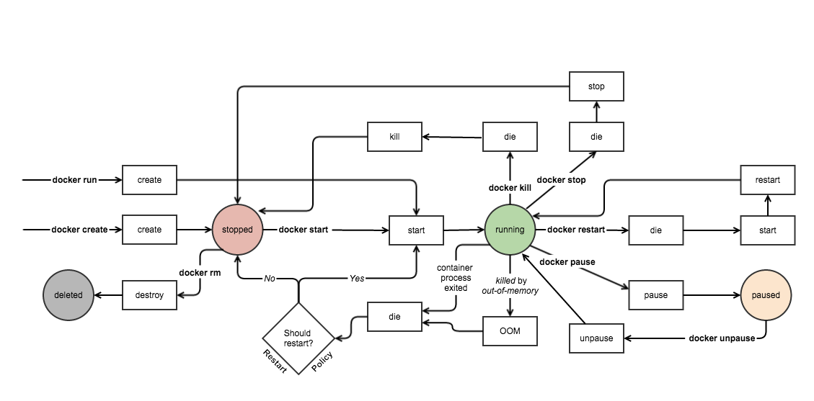

# Docker 基础用法

## 准备
1. 配置 centos 镜像：[https://developer.aliyun.com/mirror/centos?spm=a2c6h.13651102.0.0.53322f70B5uSQI](https://developer.aliyun.com/mirror/centos?spm=a2c6h.13651102.0.0.53322f70B5uSQI)
2. 安装 docker-ce 镜像：[https://developer.aliyun.com/mirror/docker-ce?spm=a2c6h.13651102.0.0.53322f70B5uSQI](https://developer.aliyun.com/mirror/docker-ce?spm=a2c6h.13651102.0.0.53322f70B5uSQI)
3. 配置 docker 加速镜像站点：
    - 编辑文件：`vim /etc/docker/daemon.json`
    ```json
    {
        "registry-mirrors": ["https://registry.docker-cn.com"]
    }
    ```

## 操作

- 搜索镜像

`docker search [镜像名称]`

- 下载镜像

`docker pull [镜像名称:Tag]` 或 `docker image pull [镜像名称:Tag]`

- 展示本地镜像列表

`docker images` 或 `docker image ls`

- 展示本地镜像详细信息列表

`docker image ls --no-trunc`

- 查看容器运行状态

`docker exec`

- 查看容器日志

`docker logs [容器名称]`

## 状态图
