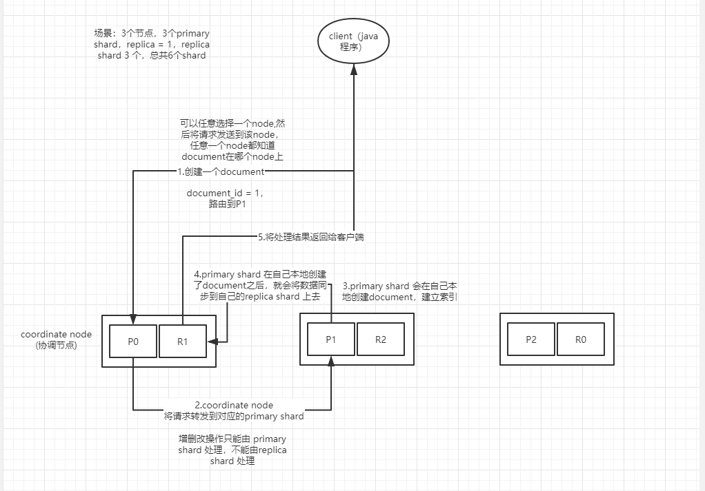

# Elasticsearch 内部原理

## document 数据路由原理
> 当创建 document 的时候，决定document存储到哪个shard上

### 路由算法
```
shard = hash(routing) % number_of_primary_shards
```
> - 当 routing 值不变时，hash(routing) 每次都相同
> - routing 的默认值是 id ，也可以手动指定 routing ，例:`PUT /index/type/id?routing=user_id`
> - 手动指定 routing 是很有必要的，这样可以保证某一类document一定被路由到一个shard上去，那么在后续进行应用级别的负载均衡以及提升批量读取的性能的时候，是很有利的

### 增删改内部处理原理图解

