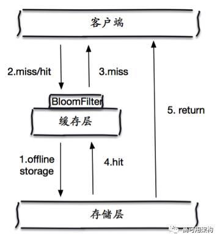
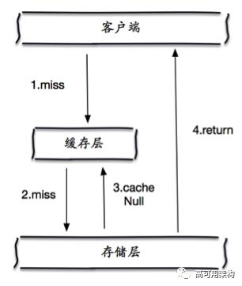
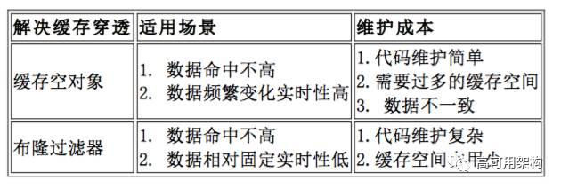
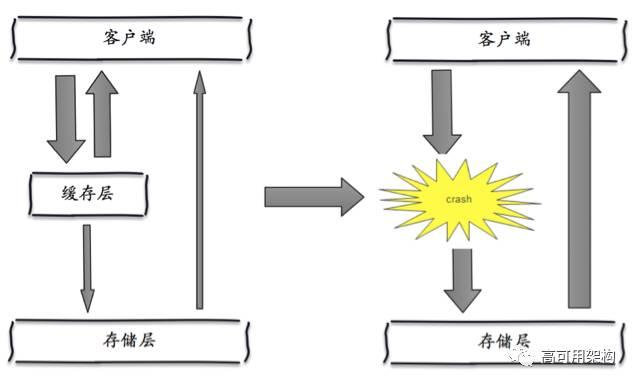

# 简述穿透、击穿、雪崩

## 缓存穿透

**概念**

缓存穿透，是指查询一个数据库一定不存在的数据。正常的使用缓存流程大致是，数据查询先进行缓存查询，如果key不存在或者key已经过期，再对数据库进行查询，并把查询到的对象，放进缓存。如果数据库查询对象为空，则不放进缓存。

**解决方案**

- **布隆过滤器**

  对所有可能查询的参数以hash形式存储，在控制层先进行校验，不符合则丢弃，从而避免了对底层存储系统的查询压力
  
  

- **缓存空对象**

  当存储层不命中后，即使返回的空对象也将其缓存起来，同时会设置一个过期时间，之后再访问这个数据将会从缓存中获取，保护了后端数据源；
  
  

- **但是这种方法会存在两个问题：**

  > 1. 如果空值能够被缓存起来，这就意味着缓存需要更多的空间存储更多的键，因为这当中可能会有很多的空值的键；
  > 2. 即使对空值设置了过期时间，还是会存在缓存层和存储层的数据会有一段时间窗口的不一致，这对于需要保持一致性的业务会有影响。

- **比较**

  

## 缓存雪崩

**概念**

缓存雪崩是指，由于缓存层承载着大量请求，有效的保护了存储层，但是如果缓存层由于某些原因整体不能提供服务，于是所有的请求都会达到存储层，存储层的调用量会暴增，造成存储层也会挂掉的情况。

**解决方案**

- 保证缓存层服务高可用性

  即使个别节点、个别机器、甚至是机房宕掉，依然可以提供服务，比如 Redis Sentinel 和 Redis Cluster 都实现了高可用。 

- 依赖隔离组件为后端限流并降级

  在缓存失效后，通过加锁或者队列来控制读数据库写缓存的线程数量。比如对某个key只允许一个线程查询数据和写缓存，其他线程等待。

- 数据预热

  可以通过缓存reload机制，预先去更新缓存，再即将发生大并发访问前手动触发加载缓存不同的key，设置不同的过期时间，让缓存失效的时间点尽量均匀。

## 缓存并发

**概念**

缓存并发是指，高并发场景下同时大量查询过期的key值、最后查询数据库将缓存结果回写到缓存、造成数据库压力过大

**解决方案**

- 分布式锁

  在缓存更新或者过期的情况下，先获取锁，在进行更新或者从数据库中获取数据后，再释放锁，需要一定的时间等待，就可以从缓存中继续获取数据。

> 摘自：https://www.cnblogs.com/George1994/p/10668889.html

